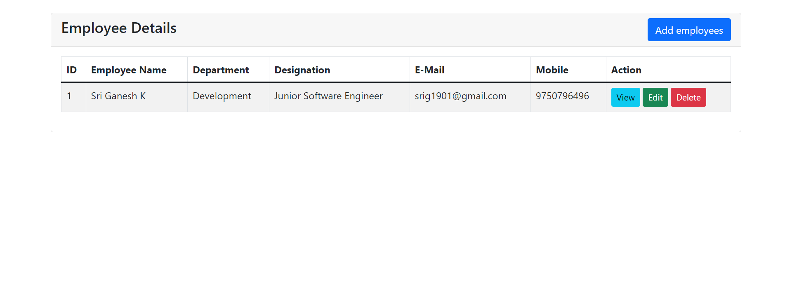
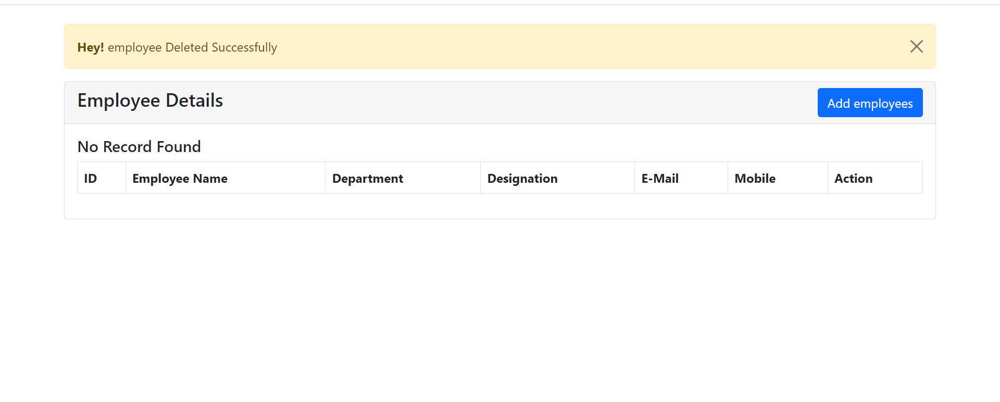
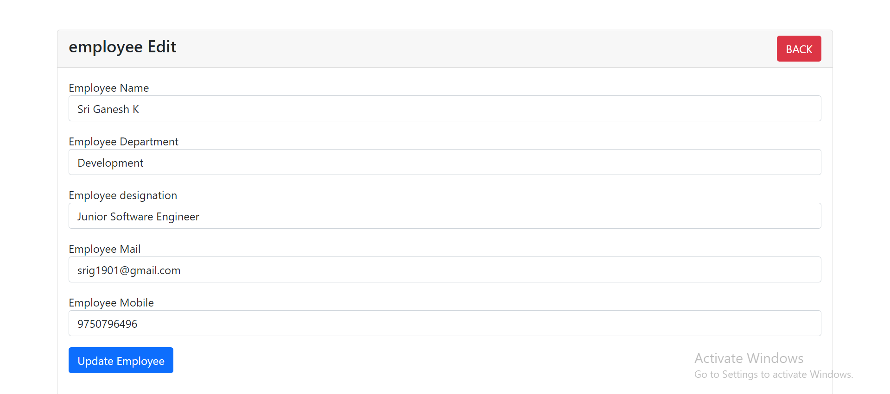
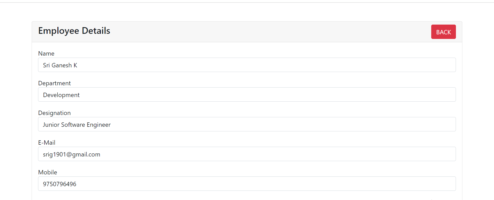

# PHP-MySQL-Login-System
CRUD Application built using PHP and MySQL .

### Prerequisites:

1. **Web Server (e.g., XAMPP, WampServer):**
   Ensure you have a web server environment set up on your machine. XAMPP is recommended for its ease of use.

2. **MySQL Database:**
   Create a new database in your MySQL server to be used by the application.
